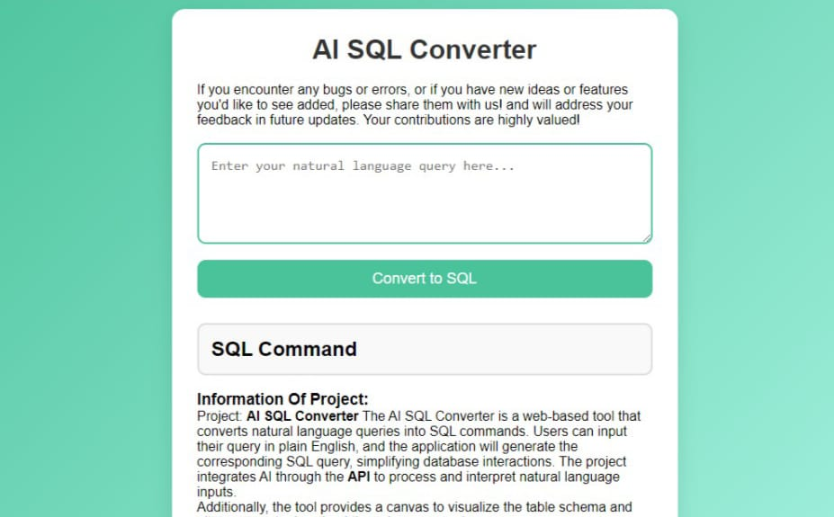
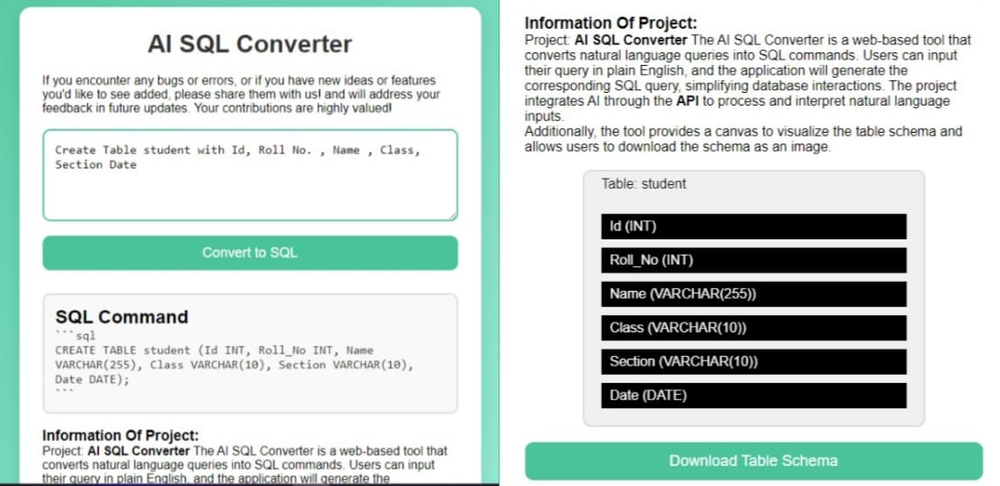

# AI SQL Converter

AI SQL Converter is a web-based application that allows users to convert natural language inputs into SQL queries. This project leverages the power of AI to help users generate SQL commands with ease, making database interactions more intuitive, especially for those who aren't familiar with SQL syntax.

## 🌐 Live Demo

Check out the live project at [AI SQL Converter](https://aisqlconverter.netlify.app/)

## 📚 Features

- 📝 **Natural Language to SQL**: Converts plain English input into SQL commands.
- 🔍 **SQL Query Generation**: Generates SELECT, INSERT, UPDATE, and DELETE queries based on user input.
- ⚙️ **Customizable**: Allows users to specify table names, column names, and conditions dynamically.
- 🎯 **User-Friendly Interface**: Simple and intuitive interface, making it accessible to users of all levels.
- 🌐 **Powered by Google Gemini API**: The natural language processing is powered by the Google Gemini API, enhancing the accuracy and efficiency of SQL query generation.

## 🚀 Getting Started

### Prerequisites
To run the project locally, you will need:
- A modern web browser (Chrome, Firefox, Edge, etc.)
- Basic knowledge of web development (HTML, CSS, JavaScript)

### Installation
1. Clone this repository:
   ```bash
   git clone https://github.com/yourusername/AI-SQL-Converter.git

## 🔧 Technologies Used

- **Frontend**: HTML, CSS, JavaScript
- **Backend**: AI API for SQL query generation
- **Hosting**: [Netlify](https://www.netlify.com/)

## 🎨 Screenshots

### Natural Language Input


### Generated SQL Query


## 🤝 Contributing

Contributions, issues, and feature requests are welcome!  
Feel free to check the [issues page](https://github.com/sarveshbijwe/AI-SQL-Converter/issues) or submit a pull request.

## ⚖️ License

This project is licensed under the MIT License. See the [LICENSE](LICENSE) file for details.

## 👤 Author

- **Sarvesh Bijwe** - Developer and Project Owner  
  [LinkedIn Profile](https://www.linkedin.com/in/sarveshbijwe)

---

Feel free to reach out for any feedback or collaboration opportunities!
